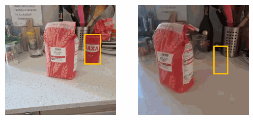

# [The Change You Want to See (Now in 3D)](#)

[[Project Page]](#) [[arXiv]](https://arxiv.org/abs/2308.10417)

In Proceedings of the IEEE/CVF International Conference on Computer Vision (ICCV) 2023

[Ragav Sachdeva](https://ragavsachdeva.github.io/), [Andrew Zisserman](https://scholar.google.com/citations?hl=en&user=UZ5wscMAAAAJ)



## Installation

TODO


## Datasets

TODO

## Example Usage

TODO

## Pre-trained model

TODO

## Citation

```
@InProceedings{Sachdeva_ICCVW_2023,
    title = {The Change You Want to See (Now in 3D)},
    author = {Sachdeva, Ragav and Zisserman, Andrew},
    booktitle = {Proceedings of the IEEE/CVF International Conference on Computer Vision (ICCV)},
    year = {2023},
}
```
